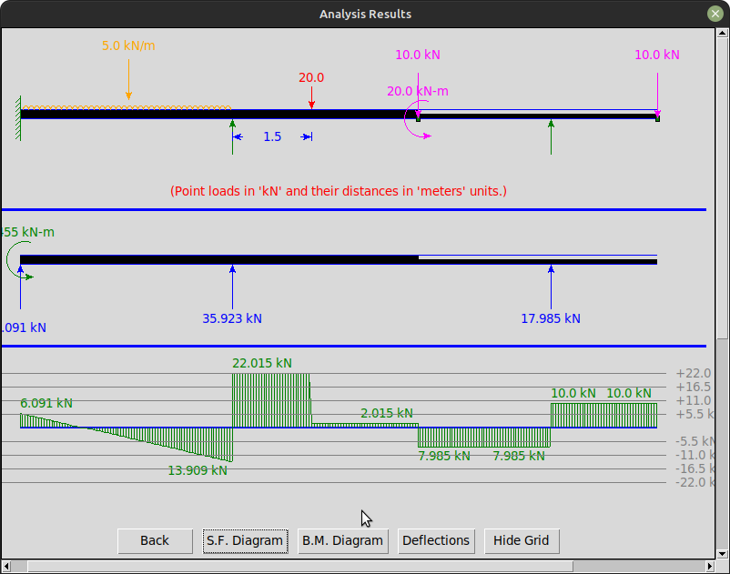
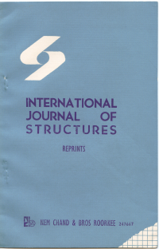
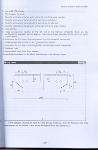
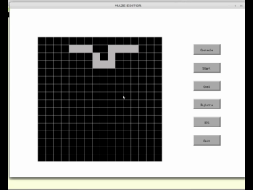
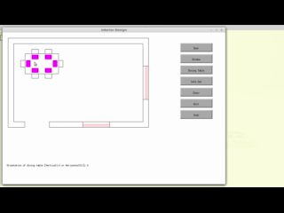

---
hide:
  - navigation
---

# Welcome to Sanjay Khirwadkar's Portfolio

## **Introduction**

I have been involved in human resource development for over 35 years. I accomplish this mission 
by educating and training students in the fields of programming languages and engineering. 
To enhance this process, I have developed various tools, including software projects, technical papers, and videos.
What follows is the showcase of some of this work.

## **Open-source Projects**

I am currently working on a structural engineering software called **StructInsight**.
The details about this software and it's source code is available at:
 [https://github.com/khirwadkar/StructInsight_in_Python](https://github.com/khirwadkar/StructInsight_in_Python)

I have developed this software as a Python package and published it on the *PyPI* repository. So, it can be easily
installed using *pip*. See the *PyPI* details at: [https://pypi.org/project/continuousbeam/](https://pypi.org/project/continuousbeam/)

The following picture is a snapshot taken during the analysis of a structure using this software.

Before developing the *Python* version of this software, I had developed it in *Java* programming language.
The source code for the same is available at:
 [https://github.com/khirwadkar/StructInsight](https://github.com/khirwadkar/StructInsight)

## **Graphics Library for C++ Programming Course**

 "A picture is worth a thousand words," goes the adage! Being educated as a civil/structural engineer, expressing my ideas in the form of engineering graphics comes naturally to me. 
I also like my students to be conversant with graphics programming. However, while conducting the initial cohorts of training courses for C++ three decades ago, 
I experienced a serious lacuna in C++: it does not have a standard graphics library. Also, programming using third-party graphics libraries like Qt or GTK required 
the graphics input and response to be handled in an asynchronous way. I quickly realized that the students found it very difficult 
to grasp both the principles of programming and the asynchronous way of handling graphics in a single course of one trimester duration. 
To overcome this obstacle, I developed my own custom graphics library that abstracted away this underlying asynchronous mechanism and 
made the process of creating graphics as easy as issuing several function calls. This library empowered my students to quickly produce 
impressive graphics-based projects. To learn more about this library and explore its capabilities, please visit the following link.
  
 Link to: [Student Manual for kiteLib Graphics Library](assets/kiteLib_Manual.html) 

Some of these projects made by students under my guidance are available on *DockerHub*. Please see them in action
by downloading the repo from the following link and executing it using *Docker*.

 [Sample C++ Projects](https://hub.docker.com/r/kitenagpur/cpp_projects_demo/)

## **Publications**

 - “Stochastic programming of concrete poles” (authors- R. Ranganathan and Sanjay G. Khirwadkar); published in
   'International Journal of Structures', Vol. 4, No. 3, July 1984. Click on the following figure to
   download a photocopy of the paper: 
   

 - “Integrative model of CAD software in steel design” (author- Sanjay G. Khirwadkar); published in the proceedings
   of 'All India Seminar on Modern Trends in Steel Structures', February 2002. Click on the following figure
   to download a photocopy of the paper: 
   

 - A monograph on Vedic Mathematics based on my experience of conducting several bootcamps and workshops on the
   subject. View it here: [Applied Vedic Mathematics.](https://gist.github.com/khirwadkar/4d36abcf260d4189d3eb01a3f0a12d84)

 - In 2002-2003, I wrote a series of articles to popularize Science, in Marathi language, in the newspaper 'Loksatta'. 
   These were published on a weekly basis for about six months. This series received first prize in a competition conducted by
   *Marathi Vidyan Parishad* (Marathi Science Movement) in 2003-2004. Links to photocopies of some of these articles
   are given below.
    - [Does god play dice?](https://khirwadkar.wordpress.com/2013/01/03/does-god-play-dice/)
    - [Method of science 1](https://khirwadkar.wordpress.com/2013/01/11/method-of-science-1/)
    - [Method of science 2](https://khirwadkar.wordpress.com/2013/01/14/method-of-science-2/)

## **YouTube Videos**

At my institution, students were mandated to undertake a culminating capstone project upon completion of 
their respective programming courses. I provided guidance in selecting project themes and delineating project scopes. 
To motivate them and boost their confidence, I additionally showcased exemplary projects completed by preceding cohorts. 
Videos of two such demonstrations are accessible via the following hyperlinks.

 - C++ project on autonomous car path search:  
   

 - C++ project for interior decorators:  
   

## **My Blog**

I have maintained a personal blog at [https://khirwadkar.wordpress.com](https://khirwadkar.wordpress.com) for over a decade. 
Most of my articles there are in English, but some are in Marathi. 
The blog is not dedicated to any particular subject; the articles there include technical tutorials and tips, 
my views about interesting current affairs (primarily technical), personal anecdotes, and travelogues. 
Links to select articles can be found below.

 - [The Quantum Way Of Computing](https://khirwadkar.wordpress.com/2020/08/03/the-quantum-way-of-computing/)

 - [chatGPT, an evolution - Marathi article](https://khirwadkar.wordpress.com/2023/01/29/chatgpt-%e0%a4%8f%e0%a4%95-%e0%a4%89%e0%a4%a4%e0%a5%8d%e0%a4%95%e0%a5%8d%e0%a4%b0%e0%a4%be%e0%a4%82%e0%a4%a4%e0%a5%80/)

 - [Research Ideas for StructInsight – Any Takers?](https://khirwadkar.wordpress.com/2024/05/01/research-ideas-for-structinsight-any-takers/)

 - [How To Bundle Graphics & Text Files In A Java Jar](https://khirwadkar.wordpress.com/2020/04/11/how-to-bundle-graphics-n-text-files-in-a-java-jar/)

 - [Self-driving Cars And India](https://khirwadkar.wordpress.com/2017/09/04/self-driving-cars-and-india/)

